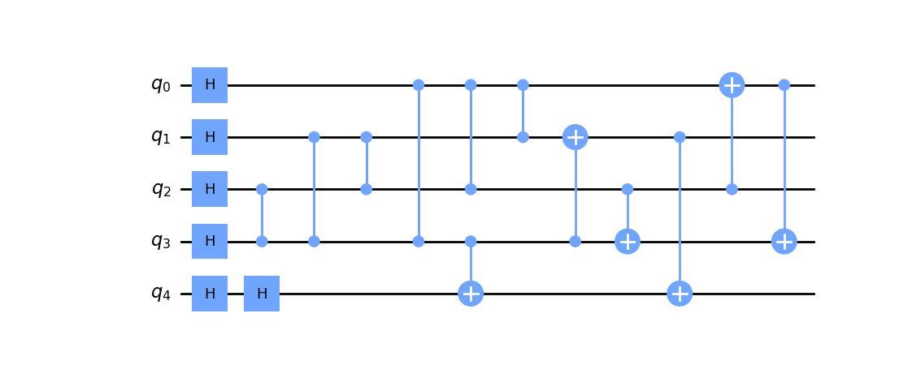

Getting Started
===============

This page details how to get started with stabilizer_project. stabilizer_project is a package designed to help use and manipulate stabilizer states

Installation
------------
To install stabilizer_project, you will need an environment with the following packages:

* Python 3.8 or superior
* NumPy
* Qiskit
* Matplotlib (optional)
* Pylatexenc (optional)
* Pdflatex (optional)

Note, you only need Matplotlib and Pylatexenc if you want to plot the circuit. If you just want do do computation, or are fine with the circuits being drawn in the shell by qiskit, these are not required.
Once you have these packages installed, you can install stabilizer_project in the same environment using
::

    git clone https://github.com/nrmanohar/stabilizer_project.git
    cd stabilizer_project
    pip install -e .

Theory
------

Background
```````````
Quantum states are very important for the purposes of quantum computing. However, one issue with representing quantum states is that they grow exponentially.

.. math::
    N = 2^n

For a standard pure quantum state, the size of the vector needed to represent it grows exponentially. However, there is a solution. It turns out a subset of quantum
states can be represented by a set of stabilizers rather than a state vector (or a density operator). Suppose we have a unitary operator

.. math::
    U = \bigotimes_i^n \sigma_i

Which is a Kronecker product of Pauli operators. Let's suppose we have some state such that


.. math::
    U|\psi\rangle = |\psi\rangle

We say that the operator :math:`U` stabilizes the state :math:`|\psi\rangle`. It turns out, for a stabilizer state, we can represent that state uniquely using :math:`n` stabilizers rather than a vector of size :math:`2^n`.


Group Theory
`````````````
For a crash course on group theory, a group is a set of elements with an associated binary operation (the set of integers with the operation of addition) that abide by four properties

1. Closed under binary operation.
2. There exists an identity element.
3. For every element of the group, there exists an inverse.
4. The operation is associative.

| Closure means that if we do the binary operation to two elements in the group, the output remains in the group. The identity element is an element of the group that, under operation, leaves the element unchanged (like the number 0 in addition or the identity matrix). The inverse is an element of the group when operated with an element, returns the identity. And associativity just means that the grouping of terms do not matter. We're not going to go too deep into the math here, but for our purposes the groups we're using will operate under standard matrix multiplication
| Suppose we have a stabilizer state :math:`|\psi\rangle`. Let :math:`N=2^n` and :math:`G` be a group such that

.. math::
    G = \{P\in P(N):P|\psi\rangle = |\psi\rangle\}

Where :math:`P(N)\subseteq U(N)` such that all :math:`M\in P` is a tensor product of Pauli matrices. We say this is the stabilizer group for the state :math:`|\psi\rangle`. If you want, you can prove that :math:`G` is in fact a group. However, this doesn't really help us, since can be a very large set. But we have something else to help us.
Every group has a set of *generators*. We denote the set of generators as :math:`S`. We denote :math:`\langle S\rangle` as the set of all combinations of the elements of :math:`S`, and in and of itself form a group. If :math:`G = \langle S\rangle`, we say :math:`S` generates :math:`G`.
If we choose a generating set carefully, they can form our *representation* of the state. We can use :math:`n` matrices to represent the state instead of a :math:`2^n` size vector.
One important thing to note, the set of stabilizers is not unique. For example, take the standard bell state :math:`|\psi\rangle = \frac{1}{2}(|00\rangle+|11\rangle)`. I can generate it's set of stabilizers from the generating set :math:`S = \{ZZ,XX\}`, but I can also generate the same set from the generators :math:`S=\{XX,-YY\}`

Tableau Formalism
```````````````````
This package utilizes a way to represent :math:`S` as an :math:`n\times 2n` matrix given as

.. math::
    T=\left(\begin{array}{c|c}  
    X & Z
    \end{array}\right)

| Where the :math:`i` th row denotes the :math:`i` th stabilizer. Let's examine the :math:`X` and :math:`Y` matrices seperately. Note these are both square :math:`n\times n` matrices. In each of these matrices, the :math:`j` th row denotes the :math:`j` th qubit.
| Let :math:`S_{i,j}` be the :math:`j` th Pauli of the :math:`i` th stabilizer (For example, if :math:`S_1=XZ` and :math:`S_2=ZX`, then :math:`S_{1,1}=X` and :math:`S_{2,1}=Z`). We denote the following using our Tableau

1. We denote :math:`S_{i,j}=I` as :math:`X_{i,j}=0` and :math:`Z_{i,j}=0`
2. We denote :math:`S_{i,j}=Z` as :math:`X_{i,j}=0` and :math:`Z_{i,j}=1`
3. We denote :math:`S_{i,j}=X` as :math:`X_{i,j}=1` and :math:`Z_{i,j}=0`
4. We denote :math:`S_{i,j}=Y` as :math:`X_{i,j}=1` and :math:`Z_{i,j}=1`

However, if you remember, a set of stabilizers for the standard bell state is :math:`S=\{XX,-YY\}`. Note the second stabilizer is :math:`-YY`. To account for this, we define a signvector, which denotes the sign of the :math:`i` th stabilizer. So with the signvector, we can denote this state as

.. math::
    T=\left(\begin{array}{cc|cc|c}  
    1 & 1 & 0 & 0 & 0\\
    1 & 1 & 1 & 1 & 1
    \end{array}\right)

| Where the last column represents the signvector.
| In this package, we use a numpy array to represent our Tableau. As such, we index from 0 to :math:`n-1` rather than from 1 to :math:`n`, and the signvector is a seperate entity from the tableau

Examples
----------
Here's a sample code with the stabilizer_project package

.. code-block:: python

    from stabilizer_project import *
    state = Stabilizer()
    state.report()

which generates the output

::

    [[1. 1. 0. 0.]
     [0. 0. 1. 1.]]
    [0. 0.]

As you can see, this is the tableau for the standard bell state. However, this isn't that useful. If you want to initialize :math:`n` qubits in the :math:`|0\rangle` state, we can instead say

.. code-block:: python

    state = Stabilizer(5)
    state.report()

which generates the output

::

    [[0. 0. 0. 0. 0. 1. 0. 0. 0. 0.]
     [0. 0. 0. 0. 0. 0. 1. 0. 0. 0.]
     [0. 0. 0. 0. 0. 0. 0. 1. 0. 0.]
     [0. 0. 0. 0. 0. 0. 0. 0. 1. 0.]
     [0. 0. 0. 0. 0. 0. 0. 0. 0. 1.]]
    [0. 0. 0. 0. 0.]

Let's do an example, building the GHZ state

.. code-block:: python

    state = Stabilizer(3)
    print(state.stabilizers())

Which generates the output

::

    [[0. 0. 0. 1. 0. 0.]
     [0. 0. 0. 0. 1. 0.]
     [0. 0. 0. 0. 0. 1.]]
    [0. 0. 0.]

We will then apply a Hadamard to the first qubit

.. code-block:: python

    state.clifford('h',0)

Which generates the output

::

    [[1. 0. 0. 0. 0. 0.]
     [0. 0. 0. 0. 1. 0.]
     [0. 0. 0. 0. 0. 1.]]
    [0. 0. 0.]

We then apply two CNOTs

.. code-block:: python

    state.clifford('cnot',0,1)
    state.clifford('cnot',1,2)

which generates the final tableau of

::

    [[1. 1. 1. 0. 0. 0.]
     [0. 0. 0. 1. 1. 0.]
     [0. 0. 0. 0. 1. 1.]]
    [0. 0. 0.]

However, if we have a complicated tableau, it might be hard to figure out what it's saying. Consider a state with the following tableau

::

    [[1. 0. 0. 1. 0. 0. 1. 1. 0. 0.]
     [0. 1. 0. 0. 1. 0. 0. 1. 1. 0.]
     [1. 0. 1. 0. 0. 0. 0. 0. 1. 1.]
     [0. 1. 0. 1. 0. 1. 0. 0. 0. 1.]
     [1. 1. 1. 1. 1. 0. 0. 0. 0. 0.]]
    [0. 0. 0. 1. 0.]

It's hard to make any sense of that. Fortunately, we have a method for that!

.. code-block:: python

    stabs=state.stabilizers()
    print(stabs)

generates the output

::

    ['XZZXI', 'IXZZX', 'XIXZZ', '-ZXIXZ', 'XXXXX']

| which is a lot easier to understand.
| Now, this might be cool, but how does one realize these states on a physical quantum computer. Our circuit comes with a circuit builder! Let's say our set of stabilizers are :math:`S=\{XZZXI, IXZZX, XIXZZ, ZXIXZ, XXXXX, ZZZZZ\}` (this is the logical 0 state in the 5 qubit error correction code)

.. code-block:: python

    state.new_stab(5,"XZZXI,IXZZX,XIXZZ,ZXIXZ,ZZZZZ")
    print(state.circuit_builder)

Generates the output

::

         ┌───┐                                     ┌───┐
    q_0: ┤ H ├────────────■───■───■────────────────┤ X ├──■──
         ├───┤            │   │   │ ┌───┐          └─┬─┘  │
    q_1: ┤ H ├──────■──■──┼───┼───■─┤ X ├───────■────┼────┼──
         ├───┤      │  │  │   │     └─┬─┘       │    │    │
    q_2: ┤ H ├──■───┼──■──┼───■───────┼────■────┼────■────┼──
         ├───┤  │   │     │           │  ┌─┴─┐  │       ┌─┴─┐
    q_3: ┤ H ├──■───■─────■───■───────■──┤ X ├──┼───────┤ X ├
         ├───┤┌───┐         ┌─┴─┐        └───┘┌─┴─┐     └───┘
    q_4: ┤ H ├┤ H ├─────────┤ X ├─────────────┤ X ├──────────
         └───┘└───┘         └───┘             └───┘

| But suppose you don't want to operate just in the terminal, or you want to save your circuit, or you want to just make it look nicer. The package has another method that makes this process streamlined (you will need the pylatexenc and matplotlib packages to do this).

.. code-block:: python

    state.draw_circuit()

Which generates the output



